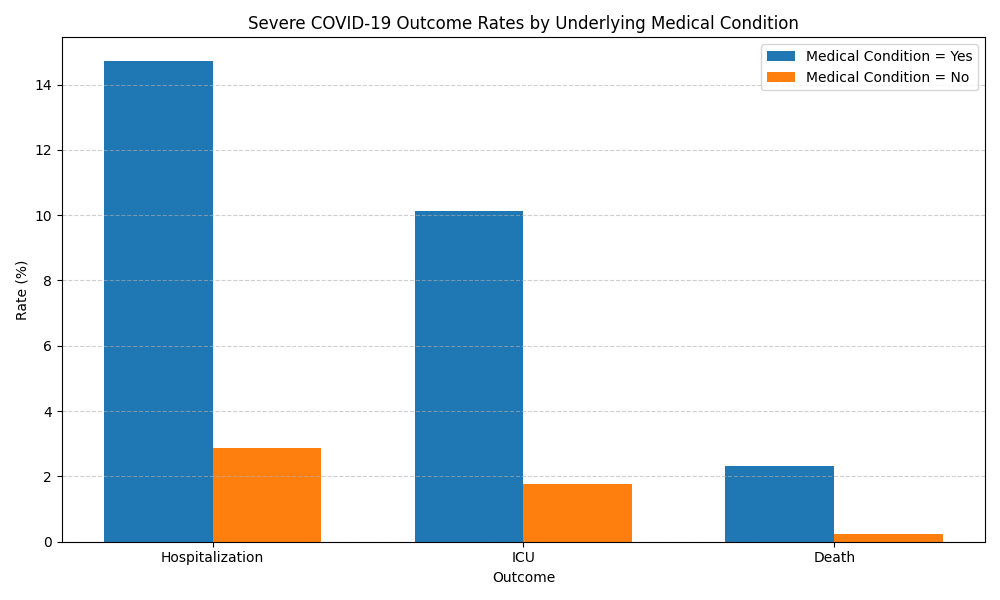

```markdown
# CDC COVID-19 Severity Analysis (Python / Pandas)

This project analyzes severe COVID-19 outcomes using the **CDC COVID-19 Case Surveillance Public Use Dataset**.

Understanding factors associated with severe COVID outcomes is important for **public health planning, hospital capacity management, and identifying vulnerable populations**.

The analysis focuses on how **hospitalization, ICU admission, and death outcomes vary across demographics and underlying medical conditions**.

The project demonstrates a complete **data analysis workflow** including:

- API data acquisition
- data cleaning and preprocessing
- outcome rate calculations
- exploratory severity analysis
- risk factor comparison

---

# Results Snapshot

Analysis of a **1 million case sample** from the CDC Case Surveillance dataset shows strong differences in severe COVID outcomes based on underlying medical conditions.

| Outcome | With Medical Conditions | Without Medical Conditions |
|------|------|------|
| Hospitalization | 14.71% | 2.87% |
| ICU Admission | 10.14% | 1.78% |
| Death | 2.32% | 0.24% |

Patients with underlying medical conditions were approximately:

• **5× more likely to be hospitalized**  
• **5–6× more likely to require ICU care**  
• **~10× more likely to die**

---

# Dataset

Source:  
CDC COVID-19 Case Surveillance Public Use Data  

https://data.cdc.gov

Dataset ID:

```

vbim-akqf

```

The full dataset contains approximately **106 million rows**, which is too large for efficient local analysis on most machines.

Instead, this project retrieves a **1,000,000 row sample** using the **Socrata Open Data API** and stores it locally as a **Parquet file** for efficient processing.

Large raw datasets are **not stored in this repository**.

To reproduce the dataset:

1. Run:

```

notebooks/01_data_acquisition_cleaning_q1.ipynb

```

2. The notebook downloads data from the CDC API and saves a cleaned dataset to:

```

data/processed/cdc_clean_1M.parquet

````

---

# Columns Used

The analysis focuses on the following variables:

| Column | Description |
|------|-------------|
| `cdc_report_dt` | Date the case was reported to the CDC |
| `age_group` | Age category of the case |
| `sex` | Reported sex |
| `race_ethnicity_combined` | Combined race/ethnicity classification |
| `hosp_yn` | Whether the case was hospitalized |
| `icu_yn` | Whether the case required ICU admission |
| `death_yn` | Whether the case resulted in death |
| `medcond_yn` | Presence of underlying medical conditions |
| `current_status` | Case classification (confirmed or probable) |

Each row represents a **de-identified patient case** reported to the CDC.

---

# Data Cleaning

The following preprocessing steps were applied:

1. Converted `cdc_report_dt` from string to datetime  
2. Created a monthly aggregation variable `case_month`  
3. Filtered the dataset to include only:
   - Laboratory-confirmed cases
   - Probable cases  
4. Preserved `"Missing"` and `"Unknown"` outcome values for transparency  
5. Created filtered subsets when calculating rates so that denominators only include **known outcome values**

Example preprocessing code:

```python
df_clean = df.copy()

df_clean["cdc_report_dt"] = pd.to_datetime(
    df_clean["cdc_report_dt"], errors="coerce"
)

df_clean["case_month"] = (
    df_clean["cdc_report_dt"]
    .dt.to_period("M")
    .astype(str)
)

df_clean = df_clean[
    df_clean["current_status"].isin(
        ["Laboratory-confirmed case", "Probable Case"]
    )
]
````

---

# Analysis Pipeline

```
CDC API
   ↓
Data Acquisition (Notebook 1)
   ↓
Data Cleaning / Feature Creation
   ↓
Severity Analysis
   • Hospitalization
   • ICU Admission
   • Death
   ↓
Risk Factor Analysis
   • Underlying Medical Conditions
```

---

# Analysis Workflow

The project is organized into several notebooks:

| Notebook                                | Purpose                                                    |
| --------------------------------------- | ---------------------------------------------------------- |
| `01_data_acquisition_cleaning_q1.ipynb` | Download and clean CDC case surveillance data              |
| `02_hospitalization_analysis.ipynb`     | Calculate hospitalization rates by age group               |
| `03_icu_analysis.ipynb`                 | Analyze ICU admission patterns                             |
| `04_death_analysis.ipynb`               | Calculate death rates across demographic groups            |
| `05_risk_factor_analysis.ipynb`         | Compare severity outcomes by underlying medical conditions |

Each notebook produces summary tables and visualizations stored in the **outputs** directory.

---

# Example Visualization



This chart compares hospitalization, ICU admission, and death rates for cases **with and without underlying medical conditions**.

---

# Key Limitation

Many outcome variables contain large shares of `"Missing"` or `"Unknown"` values.

For example, the underlying medical condition variable in the sample dataset contains approximately:

* Missing: ~80%
* Unknown: ~9%

Because the dataset was retrieved through **API pagination rather than random sampling**, the results should be interpreted as **exploratory analysis rather than population-level estimates**.

---

# Project Structure

```
cdc-covid-project
│
├── data/
│   └── processed/
│       └── cdc_clean_1M.parquet
│
├── notebooks/
│   ├── 01_data_acquisition_cleaning_q1.ipynb
│   ├── 02_hospitalization_analysis.ipynb
│   ├── 03_icu_analysis.ipynb
│   ├── 04_death_analysis.ipynb
│   └── 05_risk_factor_analysis.ipynb
│
├── outputs/
│   ├── hospitalization_by_age.csv
│   ├── icu_by_age.csv
│   ├── death_by_age.csv
│   └── severity_by_medical_condition.csv
│
├── README.md
├── requirements.txt
└── .gitignore
```

---

# Tools Used

* Python
* pandas
* NumPy
* matplotlib
* Jupyter Notebook
* Socrata Open Data API

---

# Future Improvements

Potential extensions for this analysis include:

* analyzing the full CDC dataset using cloud compute
* stratifying outcomes by vaccination period
* building interactive dashboards for severity metrics
* performing multivariate modeling of severity risk factors

```
```
